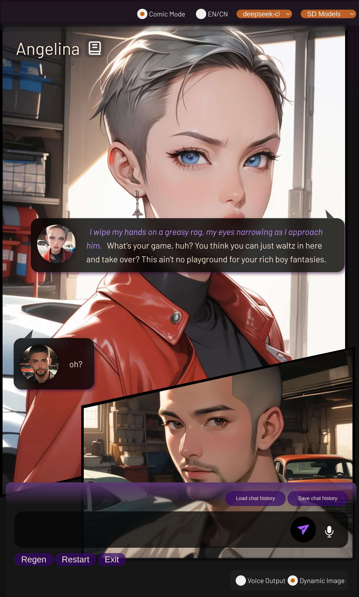

## 🌟 Cyber Chat V1.0 🌟

**_Endless Cyber Chatting Experiences_**

## Features

- Full support for remote and local inference
- Compatible with OAI, Ollama, Tabbyapi, AWSbedrock, Cohere, Claude, Deepseek, and more
- Fully integrated TTS/STT, supporting remote API or local XTTS server
- More accurate dynamic live background/avatar and face expressions based on conversation progress
- Intelligent sentence completion based on dialogue context
- Smart customized command injection integrated into user input for varied and exciting chats
- Special dynamic NSFW scenario pictures based on latest dialogue
- AI-assisted character creation for immersive story experiences
- Optimized dynamic picture generation for low-speed mobile networks

## Demo



## Installation and Setup

### Step 1: Clone and Set Up Environment

```bash
git clone https://github.com/krisshen2021/Cyber_Chat.git
cd Cyber_Chat
python -m venv venv
source venv/bin/activate
pip install -r requirements.txt
```

After installing dependencies, start your Stable Diffusion server (Auto1111 only, required).

### Step 2: Configure and Start Server

Open a new terminal and run:

```bash
cd server
source ../venv/bin/activate
mv .env_sample .env
nano .env  # Set up all API keys you own
python start_server.py
```

Follow the prompts to:
- Input Stable Diffusion address and setup info
- Select remote or local inference endpoint
- For local inference, start TabbyAPI server (in completion mode) or XTTS API server
- For remote inference, set up your API key in .env

### Step 3: Launch Cyber Chat

In the main terminal, run:

```bash
python cyberchat.py
```

## Required Servers

- TabbyAPI server: [GitHub Repo](https://github.com/theroyallab/tabbyAPI.git)
- XTTS API server: [GitHub Repo](https://github.com/daswer123/xtts-api-server.git)
- Auto1111: [GitHub Repo](https://github.com/AUTOMATIC1111/stable-diffusion-webui.git)